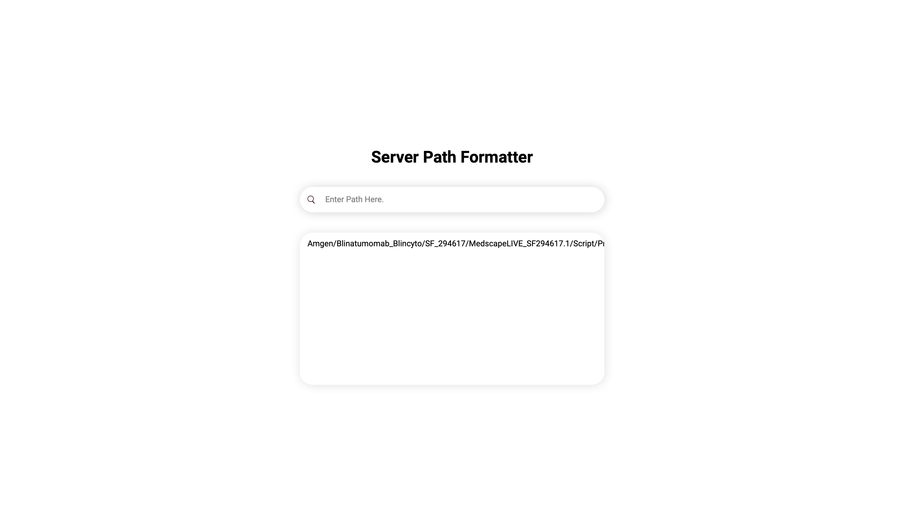

# Formatter

React app that uses localStorage to edit, update and store server paths.

### Walkthrough
- copy server path
- paste path into input
- click enter (app in the background updates the path into a format compatible with the server and adds the new path to the clipboard)
- paste path where desired

You can find the deployed app [here.](https://path-formatter.netlify.app)

## Usage
*After cloning the repository*
- `npm install` install dependencies
- `npm start` start dev server

## Interface

## Contributors
- Mike Guggenbuehl
- Ernesto Rodriguez

